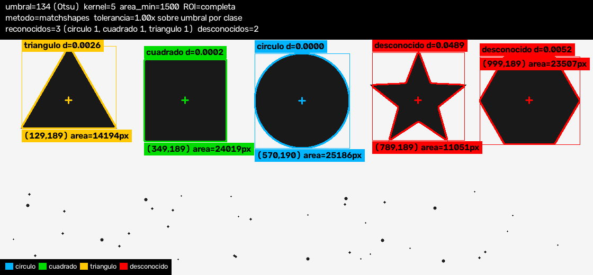

# Proyecto 1 — Detección y clasificación de formas

Visión artificial · Franco Kowalski

Detección y clasificación en tiempo real de **triángulos, cuadrados y círculos**
sobre la imagen de la webcam, en ambiente controlado (figuras oscuras sobre
fondo claro y homogéneo, cámara frontal, iluminación pareja).



## Instalación

El proyecto usa un entorno virtual. En Arch/CachyOS y en varias distros el
`pip` del sistema rechaza instalar paquetes (PEP 668), así que el venv no es
opcional:

```bash
python -m venv .venv

source .venv/bin/activate          # Linux / macOS (bash, zsh)
source .venv/bin/activate.fish     # Linux / macOS (fish)
.venv\Scripts\activate             # Windows

pip install -r requirements.txt
```

Todos los comandos de abajo asumen el venv activado (o se les antepone
`.venv/bin/python` en lugar de `python`).

## Uso

```bash
python entrenar.py     # entrena el k-NN extra (opcional, ~1 min)
python main.py         # la aplicación en vivo
```

Otros comandos:

| Comando | Para qué |
|---|---|
| `python main.py --imagen pruebas/salida/escena.png` | probar sin cámara |
| `python main.py --metodo embedding` | arrancar con el método extra (k-NN) |
| `python main.py --camara 1 --backend v4l2` | elegir cámara y backend de captura |
| `python main.py --generar-referencias` | recrear las referencias ideales |
| `python capturar_referencias.py` | tomar las referencias con tus propios objetos |
| `python -m pruebas.prueba_pipeline` | prueba de extremo a extremo, sin cámara |
| `python diagnostico_camara.py` | buscar qué backend e índice de cámara funcionan |

Teclas en la ventana principal: `q`/`ESC` salir · `espacio` pausar ·
`m` alternar matchShapes/k-NN · `g` guardar la imagen anotada en `capturas/`.

## Pipeline

1. Recorte de la **región de interés**, ajustable en vivo con las barras
   `ROI margen X %` y `ROI margen Y %`. Con las dos en 0 la escena es la imagen
   completa; con cualquier otro valor se recorta el rectángulo y se descarta el
   resto, que son las dos variantes que admite el enunciado. El rectángulo de
   la ROI se dibuja sobre la salida.
2. Conversión a escala de grises.
3. Desenfoque gaussiano y **threshold** con umbral ajustable por barra de
   desplazamiento, más opción de **umbral automático (Otsu)**. Arranca en
   manual, que es lo que pide el enunciado; con Otsu activado la barra `umbral`
   se actualiza sola para mostrar el valor que el algoritmo eligió.
4. **Operaciones morfológicas** (apertura + cierre) con el lado del elemento
   estructural ajustable por barra. El lado se fuerza a impar y la barra se
   corrige sola, para que el número que se ve sea el que se aplica.
5. Búsqueda de contornos externos y **filtrado**: se descartan los de área
   menor al mínimo ajustable y los que tocan el borde del cuadro (objetos
   cortados, cuyo contorno sería falso). Todos los contornos que sobreviven se
   procesan individualmente.
6. **Clasificación** de cada contorno por uno de los dos métodos (abajo), con
   umbral de distancia máxima de validez ajustable.
7. **Anotación**: contorno y rectángulo contenedor en el color de la clase,
   rojo para los desconocidos, cruz en el centroide, etiqueta con el nombre y
   la distancia, segunda etiqueta con las **coordenadas en píxeles y el área**,
   leyenda de colores y panel con los parámetros activos y el conteo por
   estado. Las etiquetas se reubican solas para no pisarse entre sí, no salirse
   del cuadro ni quedar tapadas por el panel.

Ventanas auxiliares con los pasos intermedios: la binaria cruda y la binaria
después de la morfología.

### Barras de desplazamiento

`umbral` · `auto (Otsu)` · `kernel (impar)` · `area min /100 px` ·
`fondo claro` · `ROI margen X %` · `ROI margen Y %` ·
`tolerancia matchShapes %` · `dist max kNN /100` ·
`metodo: 0=matchShapes 1=kNN`.

## Los dos métodos de clasificación

### 1. `matchShapes()` — el del enunciado, y el que corre por defecto

Cada clase tiene una imagen de referencia en `vision/referencias/`; el nombre
del archivo es el nombre de la clase. Se compara cada contorno contra las tres
referencias con `cv2.matchShapes()` (métrica `I1`) y gana la menor distancia
entre las que están por debajo de su umbral de validez. Si ninguna lo está, la
forma es **desconocida**.

#### Umbral de validez por clase

El enunciado permite "uno global o uno diferente para cada objeto de
referencia". Acá hay uno por clase, porque las escalas naturales difieren en
dos órdenes de magnitud. Medido sobre 60 instancias rotadas y escaladas de cada
forma, el percentil 98 de la distancia a la propia referencia da:

| clase | p98 medido | umbral |
|---|---|---|
| triángulo | 0.029 | **0.030** |
| cuadrado | 0.0018 | **0.005** |
| círculo | 0.0014 | **0.005** |

La barra `tolerancia matchShapes %` multiplica los tres a la vez (100 % = los
valores de la tabla), así se pueden aflojar o apretar en vivo sin perder la
proporción entre clases.

El efecto sobre los falsos positivos, medido sobre 40 intrusos de cada tipo:

| intruso | con umbral global 0.10 (antes) | con umbral por clase |
|---|---|---|
| hexágono | 40/40 aceptados | **0/40** |
| pentágono | 40/40 aceptados | **0/40** |
| estrella de 5 puntas | 22/40 aceptados | 11/40 |

#### La referencia del triángulo tiene que ser equilátera

`matchShapes` mide parecido de forma, no de categoría. La referencia sintética
original era un triángulo isósceles con base igual a la altura, y contra ella
un triángulo equilátero real quedaba a **0.083**, más lejos que muchos
intrusos. Con la referencia equilátera queda a **0.0009**: cien veces más
cerca. Eso es lo que permite bajar el umbral y que las formas desconocidas
dejen de colarse.

### 2. Embedding de Hu + k-NN entrenado (extra)

El contorno se proyecta a un **vector de dimensión fija** (`vision/embeddings.py`)
y se clasifica con un **k-NN entrenado** sobre miles de variantes de cada
forma (`entrenar.py`, `vision/dataset.py`, `vision/modelo.py`).

El dataset se genera sintéticamente: cada muestra es una figura dibujada con
rotación, escala, proporción, desenfoque y ruido aleatorios, de la que se
extrae el contorno. La mitad de las muestras sale de aumentar las imágenes de
`vision/referencias/`, que en el repo son las tres referencias ideales; si se
reemplazan por fotos propias con `capturar_referencias.py`, la aumentación pasa
a usar esas fotos.

## Sobre los momentos de Hu (lo que no funcionó)

La idea original era usar los 7 momentos invariantes de Hu en escala
logarítmica como embedding. **Medido sobre este proyecto, no funciona para
estas tres clases**, y vale la pena documentar por qué:

En una figura perfectamente simétrica los momentos de orden alto valen
**exactamente cero**. El logaritmo de cero es indefinido, así que h2…h7 quedan
a merced del ruido, saltando entre `0` y el tope de `±12` que impone
`_TOPE_LOG` en `vision/embeddings.py`. Medido sobre 200 círculos renderizados
con el ruido de cámara del generador:

| momento | media | desvío | mínimo | máximo |
|---|---|---|---|---|
| h1 | 0.80 | **0.00** | 0.79 | 0.80 |
| h2 | 4.56 | 0.98 | 3.20 | 10.11 |
| h3 | 8.49 | 0.69 | 6.93 | 11.59 |
| h4 | 6.19 | **5.62** | 0.00 | 12.00 |
| h6 | 0.06 | 0.83 | 0.00 | 11.74 |

h4 recorre todo el rango de punta a punta y h6 salta de 0 a 11.74. Mientras
tanto, un círculo *ideal* (sin ruido) da `[0.80, 0, 0, 0, 0, 0, 0]`: sus
momentos altos son cero exacto. Con las componentes estandarizadas, esa
diferencia ponía al círculo a varios desvíos de su propia clase y lo dejaba sin
clasificar.

El único momento estable en estas tres clases es **h1**, que además las separa
por sí solo:

| clase | h1 (log) | desvío |
|---|---|---|
| triángulo | 0.715 | 0.0012 |
| cuadrado | 0.778 | 0.0013 |
| círculo | 0.797 | 0.0012 |

El embedding final (dimensión 6) es h1 más cinco descriptores geométricos
clásicos, todos adimensionales e invariantes a rotación y escala:

| # | componente | triángulo | cuadrado | círculo |
|---|---|---|---|---|
| 0 | log-Hu h1 | .715 | .778 | .797 |
| 1 | circularidad `4πA/P²` | .55 | .71 | .88 |
| 2 | convexidad `A/A_hull` | .98 | .99 | .99 |
| 3 | llenado del rectángulo mínimo | .51 | .96 | .79 |
| 4 | llenado del círculo mínimo | .43 | .63 | .94 |
| 5 | vértices de `approxPolyDP` / 10 | .30 | .40 | .80 |

Los valores son los medidos sobre el dataset; los límites teóricos del continuo
(circularidad 1.0 en un círculo) no se alcanzan porque el contorno está
discretizado en píxeles. Las componentes se estandarizan con la media y el
desvío del entrenamiento antes de medir distancias euclídeas.

### Umbral de rechazo del k-NN

Medido sobre 180 figuras reales renderizadas, la distancia al vecino más
cercano tiene mediana 0.042, p99 0.197 y máximo 0.209. Los intrusos quedan muy
lejos: el hexágono más cercano a 0.99, el pentágono a 1.27, la estrella a 64.
Por eso el umbral por defecto es **0.50**: no rechaza ninguna figura real y
rechaza hexágonos, pentágonos y estrellas. El valor anterior (1.50) dejaba
pasar hexágonos como círculos.

## Resultados

Entrenamiento con el comando por defecto (`python entrenar.py`, 600 muestras
por clase, 25 % reservado para prueba). La exactitud está medida sobre el
**dataset sintético** — entrenamiento y prueba salen del mismo generador — así
que no es una medida del rendimiento con la webcam, sino de que las clases sean
separables en el espacio del embedding:

```
Exactitud en prueba: 100.00% (450 muestras)

Matriz de confusion (filas = real, columnas = predicho)
             triangulo   cuadrado    circulo
triangulo          149          0          0
cuadrado             0        146          0
circulo              0          0        155

Distancia al vecino mas cercano en prueba: mediana=0.039  p95=0.126
```

### Prueba de extremo a extremo

`python -m pruebas.prueba_pipeline` arma una escena con las tres figuras
conocidas, dos intrusas (**estrella de cinco puntas** y **hexágono**, que deben
quedar desconocidas) y 40 manchitas de ruido que el filtro de área tiene que
descartar. Escribe en `pruebas/salida/`, que está en `.gitignore`: no pisa
ningún archivo versionado.

```
Contornos utiles detectados: 5 (esperado 5)

--- matchShapes (umbral 1.0) ---
  OK  triangulo  predicho=triangulo    esperado=triangulo    distancia=0.0026
  OK  cuadrado   predicho=cuadrado     esperado=cuadrado     distancia=0.0002
  OK  circulo    predicho=circulo      esperado=circulo      distancia=0.0000
  OK  estrella   predicho=None         esperado=None         distancia=0.0489
  OK  hexagono   predicho=None         esperado=None         distancia=0.0052

--- embedding k-NN (umbral 0.5) ---
  OK  triangulo  predicho=triangulo    esperado=triangulo    distancia=0.1760
  OK  cuadrado   predicho=cuadrado     esperado=cuadrado     distancia=0.4826
  OK  circulo    predicho=circulo      esperado=circulo      distancia=0.0449
  OK  estrella   predicho=None         esperado=None         distancia=74.8538
  OK  hexagono   predicho=None         esperado=None         distancia=0.9911
```

Los dos métodos rechazan las dos intrusas. Se ve igual la diferencia de margen:
para `matchShapes` la estrella queda a 0.0489, apenas por encima del umbral de
0.030 del triángulo; el embedding la manda a 74.85, fuera de toda duda.

## Agregar más objetos

El enunciado pide "al menos tres". Para sumar una cuarta clase:

1. Capturar su referencia con `python capturar_referencias.py` (la tecla `4`
   sale sola de `config.CLASES`).
2. Agregar su nombre a `CLASES`, su color a `COLOR_POR_CLASE` y su umbral a
   `UMBRAL_POR_CLASE` en `vision/config.py`.
3. `python entrenar.py`. Si la clase no tiene un generador sintético propio,
   todas sus muestras salen de aumentar su imagen de referencia.

## Estructura

```
main.py                      aplicación en vivo
entrenar.py                  genera el dataset y entrena el k-NN
capturar_referencias.py      toma las referencias con la webcam
diagnostico_camara.py        busca un backend de cámara que funcione
requirements.txt             dependencias
vision/config.py             parámetros, colores y umbrales por clase
vision/camara.py             apertura de la webcam portable entre sistemas
vision/procesamiento.py      ROI -> gris -> threshold -> morfología -> contornos
vision/referencias.py        carga y genera los contornos de referencia
vision/embeddings.py         contorno -> vector de forma
vision/dataset.py            generación y aumentación de muestras
vision/modelo.py             k-NN, evaluación y persistencia
vision/clasificador.py       los dos métodos, con la misma interfaz
vision/anotacion.py          contornos, etiquetas, leyenda y panel
vision/interfaz.py           barras de desplazamiento
vision/referencias/          una imagen por clase
modelo/modelo.npz            modelo k-NN ya entrenado
pruebas/prueba_pipeline.py   prueba de extremo a extremo sin cámara
```

## Si la cámara no abre

`python diagnostico_camara.py` prueba todos los backends que este build de
OpenCV trae compilados, con los índices 0 a 3, e imprime la línea de comando
exacta que corresponde usar.

**La causa más común es pedir un backend que no existe en la plataforma.**
`cv2.VideoCapture(0, cv2.CAP_DSHOW)` en Linux no lanza ninguna excepción ni
imprime nada: devuelve un objeto cerrado. Por eso `vision/camara.py` prueba los
backends que corresponden al sistema operativo (V4L2 y GStreamer en Linux,
MSMF y DirectShow en Windows, AVFoundation en macOS) y se queda con el primero
que abra **y además lea un cuadro**.

### En Linux

- Los dispositivos se listan con `ls -l /dev/video*` (y con más detalle con
  `v4l2-ctl --list-devices`, del paquete `v4l-utils`).
- El índice `N` de `--camara N` corresponde a `/dev/videoN`. Muchas webcams
  exponen dos nodos y solo el primero da video.
- Si el dispositivo existe pero no abre, ver quién lo tiene tomado con
  `fuser /dev/video0`, y comprobar la pertenencia al grupo `video` con `groups`.

### En Windows

Hay que habilitar **Configuración → Privacidad y seguridad → Cámara → Permitir
que las aplicaciones de escritorio accedan a la cámara**, y cerrar cualquier
programa que tenga tomada la cámara (Zoom, Teams, Discord): el acceso es
exclusivo.

### Sin cámara

El pipeline completo se puede mostrar igual con
`python main.py --imagen <foto>`, que abre las mismas ventanas y barras de
desplazamiento sobre una imagen fija.

## Ambiente controlado

El sistema asume figuras oscuras sobre fondo claro y homogéneo (por ejemplo
dibujadas con fibrón negro sobre una hoja blanca), iluminación pareja sin
sombras marcadas y cámara perpendicular al plano. Si el fondo es oscuro y los
objetos claros, se destilda la barra `fondo claro`. Para acotar la escena a una
parte del cuadro se usan las barras `ROI margen X %` y `ROI margen Y %`.

Las tres imágenes de `vision/referencias/` que trae el repo son siluetas
ideales generadas por el propio código, para que el proyecto ande recién
clonado. Lo que el enunciado pide de verdad es reemplazarlas por una foto de
cada objeto real, con `python capturar_referencias.py`.
