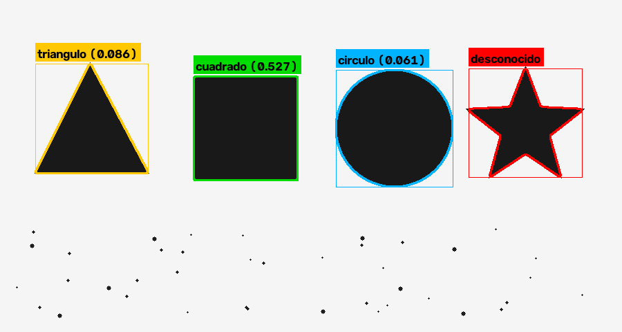

# Proyecto 1 — Detección y clasificación de formas

Visión artificial · Franco Kowalski

Detección y clasificación en tiempo real de **triángulos, cuadrados y círculos**
sobre la imagen de la webcam, en ambiente controlado (figuras oscuras sobre
fondo claro y homogéneo, cámara frontal, iluminación pareja).



## Instalación

```bash
pip install -r requirements.txt
```

## Uso

```bash
python entrenar.py
```

```bash
python main.py
```

Otros comandos:

| Comando | Para qué |
|---|---|
| `python main.py --imagen pruebas/escena.png` | probar sin cámara |
| `python main.py --metodo matchshapes` | arrancar con el método del enunciado |
| `python main.py --generar-referencias` | recrear las referencias ideales |
| `python capturar_referencias.py` | tomar las referencias con tus propios objetos |
| `python -m pruebas.prueba_pipeline` | prueba de extremo a extremo, sin cámara |
| `python diagnostico_camara.py` | buscar qué backend e índice de cámara funcionan |

Teclas en la ventana principal: `q`/`ESC` salir · `g` guardar la imagen
anotada en `capturas/` · `espacio` pausar.

## Pipeline

1. Recorte de la región de interés (`ROI_RELATIVA` en `vision/config.py`).
2. Conversión a escala de grises.
3. Desenfoque gaussiano y **threshold** con umbral ajustable por barra de
   desplazamiento, más opción de **umbral automático (Otsu)**.
4. **Operaciones morfológicas** (apertura + cierre) con el lado del elemento
   estructural ajustable por barra de desplazamiento.
5. Búsqueda de contornos externos y **filtrado**: se descartan los de área
   menor al mínimo ajustable y los que tocan el borde del cuadro (objetos
   cortados, cuyo contorno sería falso).
6. **Clasificación** de cada contorno por uno de los dos métodos (abajo), con
   umbral de distancia máxima de validez ajustable.
7. **Anotación**: contorno y rectángulo contenedor en el color de la clase,
   rojo para los desconocidos, etiqueta con el nombre y la distancia, y panel
   con los parámetros activos y el conteo de objetos.

Ventanas auxiliares con los pasos intermedios: la binaria cruda y la binaria
después de la morfología.

### Barras de desplazamiento

`umbral` · `auto (Otsu)` · `kernel` · `area min /100` ·
`dist max matchShapes /100` · `dist max kNN /100` · `fondo claro` ·
`metodo: 0=kNN 1=matchShapes`.

## Los dos métodos de clasificación

### 1. `matchShapes()` — el del enunciado

Cada clase tiene una imagen de referencia en `vision/referencias/`; el nombre
del archivo es el nombre de la clase. Se compara cada contorno detectado
contra las tres referencias con `cv2.matchShapes()` (métrica `I1`) y se elige
la menor distancia, siempre que esté por debajo del umbral de validez.

### 2. Embedding de Hu + k-NN entrenado

El contorno se proyecta a un **vector de dimensión fija** (`vision/embeddings.py`)
y se clasifica con un **k-NN entrenado** sobre miles de variantes de cada
forma (`entrenar.py`, `vision/dataset.py`, `vision/modelo.py`).

El dataset se genera sintéticamente: cada muestra es una figura dibujada con
rotación, escala, proporción, desenfoque y ruido aleatorios, de la que se
extrae el contorno con el mismo pipeline que la cámara. Si hay fotos propias
en `vision/referencias/`, la mitad de las muestras salen de aumentarlas.

## Sobre los momentos de Hu (lo que no funcionó)

La idea original era usar los 7 momentos invariantes de Hu en escala
logarítmica como embedding. **Medido sobre este proyecto, no funciona para
estas tres clases**, y vale la pena documentar por qué:

En una figura perfectamente simétrica los momentos de orden alto valen
**exactamente cero**. El logaritmo de cero es indefinido, así que h3…h7 saltan
entre `0` y `±30` según el ruido del cuadro. Incluso h2 es degenerado: vale
cero exacto en un cuadrado o un círculo ideal. Sobre la escena de prueba, un
círculo real daba `[0.798, 0, 0, 0, 0, 0, 0]` mientras el entrenamiento
esperaba `[0.797, 4.50, 8.75, 12.19, …]`. Con las componentes estandarizadas,
esa diferencia ponía al círculo a **3.2 desvíos** de su propia clase y lo
dejaba sin clasificar.

El único momento estable en estas tres clases es **h1**, que además las separa
por sí solo:

| clase | h1 (log) | desvío |
|---|---|---|
| triángulo | 0.714 | 0.003 |
| cuadrado | 0.777 | 0.001 |
| círculo | 0.797 | 0.001 |

El embedding final (dimensión 6) es h1 más cinco descriptores geométricos
clásicos, todos adimensionales e invariantes a rotación y escala:

| # | componente | triángulo | cuadrado | círculo |
|---|---|---|---|---|
| 0 | log-Hu h1 | .71 | .78 | .80 |
| 1 | circularidad `4πA/P²` | .60 | .79 | 1.0 |
| 2 | convexidad `A/A_hull` | ~1 | ~1 | ~1 |
| 3 | llenado del rectángulo mínimo | .50 | 1.0 | .79 |
| 4 | llenado del círculo mínimo | .41 | .64 | 1.0 |
| 5 | vértices de `approxPolyDP` / 10 | .3 | .4 | ≥.7 |

Las componentes se estandarizan con la media y el desvío del entrenamiento
antes de medir distancias euclídeas, porque tienen rangos distintos.

## Resultados

Entrenamiento con 600 muestras por clase, 25 % reservado para prueba:

```
Exactitud en prueba: 100.00% (450 muestras)

Matriz de confusion (filas = real, columnas = predicho)
             triangulo   cuadrado    circulo
triangulo          149          0          0
cuadrado             0        146          0
circulo              0          0        155

Distancia al vecino mas cercano: mediana=0.044  p95=0.134
```

La mediana de 0.044 y el p95 de 0.134 son los que justifican el umbral de
rechazo por defecto de **1.5**: cualquier forma a más de esa distancia del
entrenamiento se marca como desconocida.

### Prueba de extremo a extremo

`python -m pruebas.prueba_pipeline` arma una escena con las tres figuras, una
**estrella de cinco puntas** (que debe quedar como desconocida) y 40 manchitas
de ruido que el filtro de área tiene que descartar:

```
Contornos utiles detectados: 4 (esperado 4)

--- matchShapes (umbral 0.1) ---
  OK  predicho=triangulo    esperado=triangulo    distancia=0.0363
  OK  predicho=cuadrado     esperado=cuadrado     distancia=0.0002
  OK  predicho=circulo      esperado=circulo      distancia=0.0000
  TOL predicho=triangulo    esperado=None         distancia=0.0393

--- embedding k-NN (umbral 1.5) ---
  OK  predicho=triangulo    esperado=triangulo    distancia=0.0864
  OK  predicho=cuadrado     esperado=cuadrado     distancia=0.5269
  OK  predicho=circulo      esperado=circulo      distancia=0.0605
  OK  predicho=None         esperado=None         distancia=81.9547
```

Ahí se ve la diferencia entre los dos métodos. Para `matchShapes` la estrella
queda a **0.0393** del triángulo, apenas más que los **0.0363** de un triángulo
de verdad: no hay ningún umbral que rechace una y acepte el otro de forma
confiable. El embedding la manda a **81.95**, fuera de cualquier duda. Esa
falla de `matchShapes` está marcada `TOL` en la prueba, como limitación
conocida del método y no como error del pipeline.

## Estructura

```
main.py                      aplicación en vivo
entrenar.py                  genera el dataset y entrena el k-NN
capturar_referencias.py      toma las referencias con la webcam
diagnostico_camara.py        busca un backend de camara que funcione
vision/config.py             parámetros y colores por clase
vision/procesamiento.py      gris -> threshold -> morfología -> contornos
vision/embeddings.py         contorno -> vector de forma
vision/dataset.py            generación y aumentación de muestras
vision/modelo.py             k-NN, evaluación y persistencia
vision/clasificador.py       los dos métodos, con la misma interfaz
vision/anotacion.py          dibujo de contornos, etiquetas y panel
vision/interfaz.py           barras de desplazamiento
vision/referencias/          una imagen por clase
pruebas/prueba_pipeline.py   prueba de extremo a extremo sin cámara
```

## Si la cámara no abre

`python diagnostico_camara.py` prueba las combinaciones de backend
(`CAP_MSMF`, `CAP_DSHOW`, `CAP_ANY`) e índice, e informa cuál funciona. El
índice se ajusta con `--camara N` en `main.py`.

En Windows, además, hay que habilitar **Configuración → Privacidad y
seguridad → Cámara → Permitir que las aplicaciones de escritorio accedan a
la cámara**, y cerrar cualquier programa que tenga tomada la cámara (Zoom,
Teams, Discord): el acceso es exclusivo.

Sin cámara, el pipeline completo se puede mostrar igual con
`python main.py --imagen <foto>`, que abre las mismas ventanas y barras de
desplazamiento sobre una imagen fija.

## Ambiente controlado

El sistema asume figuras oscuras sobre fondo claro y homogéneo (por ejemplo
dibujadas con fibrón negro sobre una hoja blanca), iluminación pareja sin
sombras marcadas y cámara perpendicular al plano. Si el fondo es oscuro y los
objetos claros, se destilda la barra `fondo claro`. Para acotar la escena a
una parte del cuadro se ajusta `ROI_RELATIVA` en `vision/config.py`.
